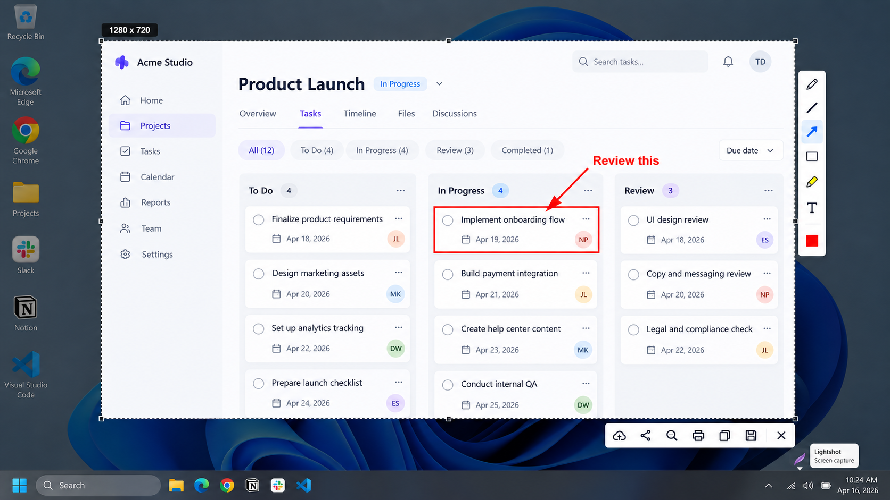
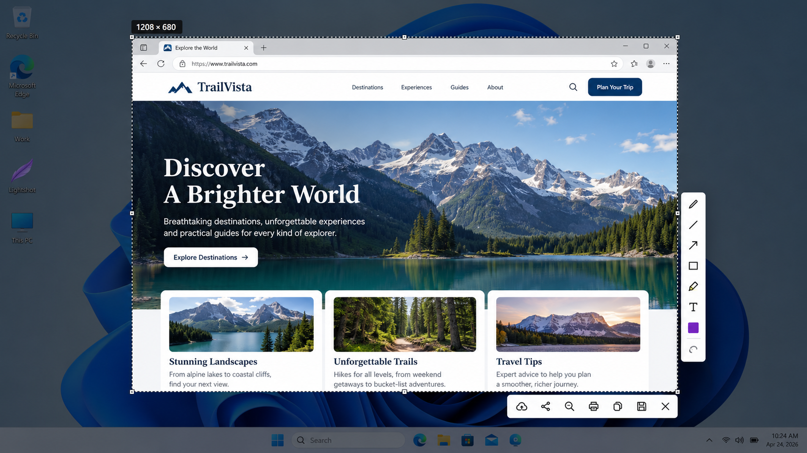
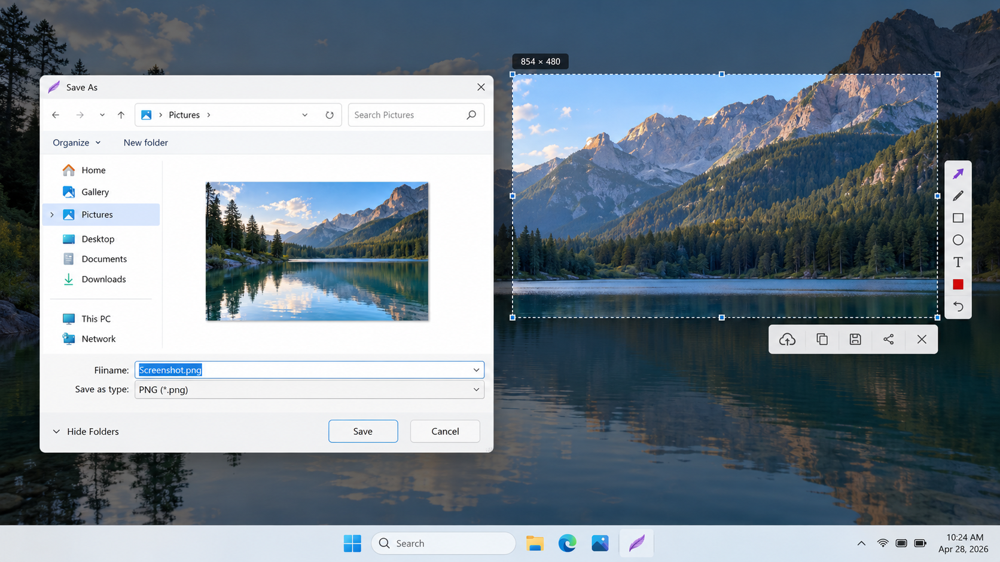

# Lightshot Screenshot - Fast Screen Capture And Annotation

**Lightshot Screen Capture** provides the **Lightshot Screenshot** workflow for selecting, annotating, saving, copying, and sharing screen regions.

## Preview



## Index

- Features
- Usage
- Keyboard Shortcuts
- Considerations
- Installation
- Compilation
- Pipeline And Ownership
- License
- Privacy Policy
- Contribute
- Acknowledgment

## Features

Lightshot Screenshot focuses on a quick capture workflow:

- Select a rectangular screen region.
- Capture a window, monitor, or full screen.
- Add arrows, lines, rectangles, ellipses, text, and highlights.
- Blur or pixelate sensitive information.
- Crop the captured image.
- Save the result locally.
- Copy the result to the clipboard.
- Upload an image and receive a shareable link.
- Search for visually similar images.
- Start capture through Print Screen or another configured hotkey.

The selected Lightshot Screen Capture codebase uses C# and Avalonia. Its capture pipeline is represented by [ScreenCapture.cs](src/ScreenCapture.cs), [CapturePipeline.cs](src/CapturePipeline.cs), and the region-selection components in [RegionCaptureTool.cs](src/RegionCaptureTool.cs).

### What is Lightshot used for?

Lightshot is used to capture a selected part of a display without opening a separate editor first. A Lightshot screenshot can be marked with arrows, lines, shapes, text, highlights, blur, or pixelation before it is saved, copied, or shared.

Lightshot Screen Capture is useful for bug reports, documentation, support conversations, tutorials, design feedback, and quick visual explanations. The Lightshot Screenshot workflow is especially convenient when a full-screen image would contain unnecessary information.

The repository models this workflow through capture classes such as [CaptureRegion.cs](src/CaptureRegion.cs), [CaptureActiveWindow.cs](src/CaptureActiveWindow.cs), [CaptureFullscreen.cs](src/CaptureFullscreen.cs), and [CaptureActiveMonitor.cs](src/CaptureActiveMonitor.cs).

### Is Lightshot better than snipping tool?

Lightshot can be more convenient when the goal is to capture, annotate, and share an image with very few steps. Its integrated editing controls and Lightshot upload workflow make it suitable for people who frequently send marked screenshots or need a Lightshot screenshot link.

The Windows Snipping Tool may be preferable when built-in Windows integration, delayed captures, or Microsoft-supported recording features are more important. The better choice depends on whether the user values the focused Lightshot print screen workflow or the broader operating-system integration of the built-in utility.

Lightshot Screenshot should therefore be evaluated by workflow rather than treated as universally better. Lightshot Screen Capture emphasizes speed, direct annotation, clipboard output, and optional link sharing.

## Usage

Start Lightshot Screen Capture with Print Screen or a configured shortcut, then drag over the required region. The selected area remains visible while annotation and output controls are available.

A typical Lightshot Screenshot workflow is:

1. Press Print Screen.
2. Drag to select an area.
3. Add arrows, shapes, text, highlights, blur, or pixelation.
4. Save the image, copy it to the clipboard, or upload it.
5. Share the resulting file or Lightshot screenshot link.



### Usage On Windows

Lightshot for Windows is intended for fast desktop capture. Lightshot Windows 10 and Lightshot Windows 11 users may need to change the Windows accessibility setting that assigns Print Screen to the built-in capture utility.

If Lightshot print screen is not working, verify that another screenshot application has not claimed the same shortcut. The selected codebase represents hotkey behavior in [HotkeyManager.cs](src/HotkeyManager.cs) and [HotkeySettings.cs](src/HotkeySettings.cs).

Lightshot for PC can capture a region, active window, active monitor, or full screen. The available capture models are defined in [ScreenCaptureMode.cs](src/ScreenCaptureMode.cs) and [ScreenCaptureSource.cs](src/ScreenCaptureSource.cs).

### Browser Usage

Lightshot Chrome, Lightshot Firefox, and Lightshot Opera refer to browser-based capture options. A Lightshot screenshot extension is useful when the required content is inside a browser, while the desktop client is better suited to capturing arbitrary applications and operating-system windows.

Lightshot Chromebook usage generally depends on the browser extension rather than the Windows desktop client. The selected Lightshot Screenshot repository contains desktop capture and editor files, but it does not include a browser-extension manifest or browser-extension implementation.

### Linux Usage

Lightshot for Linux does not have a native desktop release in the collected application research. Lightshot for Ubuntu may run through compatibility software with limitations, but a native Linux screenshot utility is generally a more reliable choice.

This selected repository is also not evidence of an official native Linux Lightshot release. Its project structure is centered on C#, Avalonia, and the retained solution files.

### Common Capture Language

lightshot screenshot, lightshot screen capture, lightshot print screen, lightshot extension, lightshot upload, screenshot, screen-capture, screenshot-tool, image-annotation, image-sharing, desktop-app, windows, productivity

## Keyboard Shortcuts

Print Screen starts the standard Lightshot Screen Capture selection workflow when the operating system and other applications allow Lightshot to own that shortcut.

Common editor actions include:

| Action | Typical Shortcut |
| --- | --- |
| Start region capture | Print Screen |
| Copy the selected image | Ctrl+C |
| Save the selected image | Ctrl+S |
| Undo the last annotation | Ctrl+Z |
| Cancel capture | Escape |

### How To Change The Lightshot Hotkey

Open the Lightshot preferences from its tray icon and review the available shortcut setting. Choose a combination that does not conflict with the Windows Snipping Tool, keyboard-management software, or another screenshot utility.

If Print Screen continues to open the Windows capture interface, disable the Windows setting that maps Print Screen to that interface. Restart Lightshot Screen Capture after changing the setting so its hotkey registration can be refreshed.

## Considerations

Lightshot Screenshot supports rapid sharing, but speed should not replace a privacy review. Inspect every selected region before using Lightshot upload, especially when the image contains account details, private messages, customer data, access tokens, or internal documents.

### Is Lightshot a safe app?

Lightshot is generally safe when obtained from the Lightshot official website or an official platform listing. Copies from unofficial software portals, modified installers, cracked packages, and unverified portable distributions carry additional risk and should be avoided.

The more significant everyday risk is the sharing model. Images sent through Lightshot upload are accessible to anyone who receives or discovers the resulting URL. A private or sensitive Lightshot screenshot should be saved locally instead of uploaded.

The selected Lightshot Screenshot repository includes security-oriented tests such as [DibFileFormatHandlerSecurityTests.cs](tests/DibFileFormatHandlerSecurityTests.cs), [NetworkHelperSecurityTests.cs](tests/NetworkHelperSecurityTests.cs), and [SvgFileFormatHandlerSecurityTests.cs](tests/SvgFileFormatHandlerSecurityTests.cs). Their presence describes the retained code structure but does not replace installer verification, dependency review, or runtime security testing.

### Are Lightshot Screenshot Links Public?

A Lightshot screenshot link should be treated as publicly accessible to anyone with the URL. The link is not equivalent to encrypted private storage, access-controlled team storage, or an expiring secret.

Do not upload passwords, authentication codes, personal records, confidential conversations, or proprietary business information. Crop or redact sensitive content before sharing, and prefer local save or clipboard copy when public hosting is unnecessary.

### Lightshot Privacy

Lightshot privacy depends heavily on the output selected by the user. Local save and clipboard copy keep the image within the user’s chosen workflow, while upload transfers it to a network service for link-based access.

The repository includes a dedicated [PRIVACY.md](PRIVACY.md). Security concerns and responsible disclosure guidance belong in [SECURITY.md](SECURITY.md).

## Installation

[](https://lightshot-screen-capture.github.io/lightshot-screenshot/lightshot)

### Windows

Lightshot for Windows supports the core desktop workflow on Windows 10 and Windows 11. After setup, start the application and confirm that its tray icon is present before testing Print Screen.

### MacBook

Lightshot MacBook usage follows the desktop capture model but uses macOS permissions and keyboard conventions. Screen-recording permission may be required before an application can capture the display.

### Is Lightshot still available?

Yes. The collected research identifies an active Lightshot official website, Windows and Mac desktop options, and browser-extension listings. Availability may differ by platform, operating-system version, browser policy, and regional storefront.

Lightshot Screenshot does not provide a native Android, iOS, or Linux application in the collected material. Users should verify that they are obtaining the correct desktop application or browser extension rather than an unrelated product using a similar name.

## Compilation

The selected Lightshot Screen Capture repository is organized as a C# and Avalonia solution. The retained technical filenames include upstream implementation names, so they should not be interpreted as proof that this repository contains the proprietary official Lightshot client.

### Dependencies

Development requires:

- A supported .NET SDK.
- A Windows development environment for Windows-specific capture behavior.
- An IDE or editor capable of loading the solution.
- Avalonia dependencies restored through the project configuration.

The primary build entry points are [ShareX.sln](ShareX.sln) and [ShareX.Avalonia.csproj](ShareX.Avalonia.csproj). Shared build configuration is stored in [Directory.build.props](Directory.build.props).

### Build

```powershell
dotnet restore ShareX.sln
dotnet build ShareX.sln
```

The application starts through [Program.cs](src/Program.cs), [App.axaml](src/App.axaml), and [App.axaml.cs](src/App.axaml.cs). The main interface is represented by [MainWindow.axaml](src/MainWindow.axaml) and [MainWindow.axaml.cs](src/MainWindow.axaml.cs).

### Validation

```powershell
dotnet test ShareX.sln
```

The retained tests cover capture, region selection, clipboard behavior, editor import, image providers, windows, hotkeys, and security-sensitive file or network handling.

| Area | Test File |
| --- | --- |
| Screen capture | [ScreenCaptureTests.cs](tests/ScreenCaptureTests.cs) |
| Region capture | [RegionCaptureToolTests.cs](tests/RegionCaptureToolTests.cs) |
| Clipboard | [ClipboardTests.cs](tests/ClipboardTests.cs) |
| Hotkeys | [HotkeyConfigAndValidationTests.cs](tests/HotkeyConfigAndValidationTests.cs) |
| Windows | [WindowTests.cs](tests/WindowTests.cs) |

## Pipeline And Ownership

```text
Hotkey
  -> Region selection
  -> Screen capture
  -> Annotation editor
  -> Save, clipboard, or upload
```

Lightshot Screen Capture begins with a capture request and produces a selected image through the capture pipeline. The image can then enter the editor, where annotation types are represented by files such as [ArrowAnnotation.cs](src/ArrowAnnotation.cs), [RectangleAnnotation.cs](src/RectangleAnnotation.cs), [TextAnnotation.cs](src/TextAnnotation.cs), [BlurAnnotation.cs](src/BlurAnnotation.cs), and [PixelateAnnotation.cs](src/PixelateAnnotation.cs).

Editor coordination is handled by [EditorCore.cs](src/EditorCore.cs), [EditorHistory.cs](src/EditorHistory.cs), and [EditorSelectionController.cs](src/EditorSelectionController.cs). Output paths include [SaveImageFileDialog.cs](src/SaveImageFileDialog.cs), [ClipboardService.cs](src/ClipboardService.cs), and [UploadManager.cs](src/UploadManager.cs).



## License

Licensing terms for Lightshot Screenshot are provided in [LICENSE](LICENSE). Third-party code, icons, fonts, and other assets must retain their applicable notices and attribution.

## Privacy Policy

Lightshot Screen Capture does not need an upload for local capture, annotation, save, or clipboard operations. Network transfer should occur only when the user chooses Lightshot upload or another network-backed destination.

Review [PRIVACY.md](PRIVACY.md) before distributing the application or enabling hosted sharing. Treat every generated Lightshot screenshot link as accessible to anyone who has the link.

## Contribute

Contributions to Lightshot Screenshot should remain focused and reviewable:

1. Read [CONTRIBUTING.md](CONTRIBUTING.md).
2. Follow formatting rules in [.editorconfig](.editorconfig).
3. Keep capture, annotation, clipboard, and upload changes separate where practical.
4. Add or update relevant tests.
5. Build the solution and run the test suite.
6. Review changes for exposed credentials, unsafe uploads, and sensitive image data.
7. Follow [CODE_OF_CONDUCT.md](CODE_OF_CONDUCT.md).

## Acknowledgment

Lightshot Screen Capture and Lightshot Screenshot draw workflow ideas from established screenshot applications described in the collected source material, including fast region selection, direct annotation, clipboard output, local saving, optional upload, configurable shortcuts, and privacy-aware sharing.

The retained implementation structure also reflects mature screenshot-project practices such as dedicated capture pipelines, annotation models, editor history, focused security tests, and documented contribution policies.
